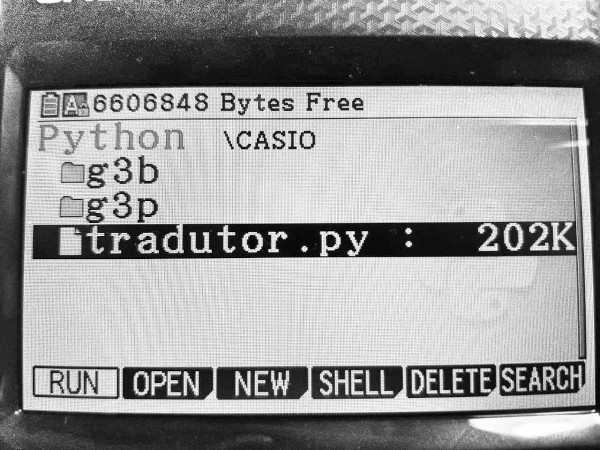
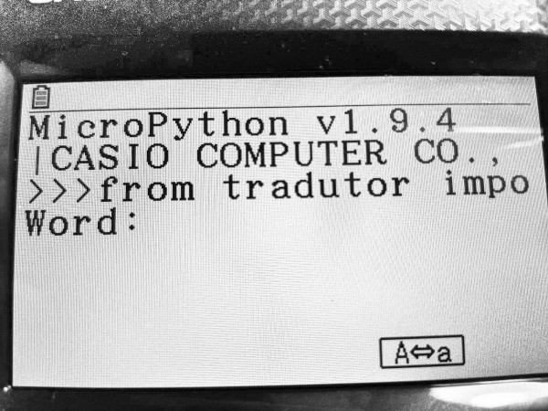
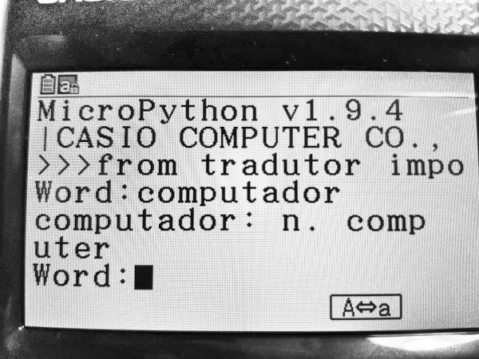
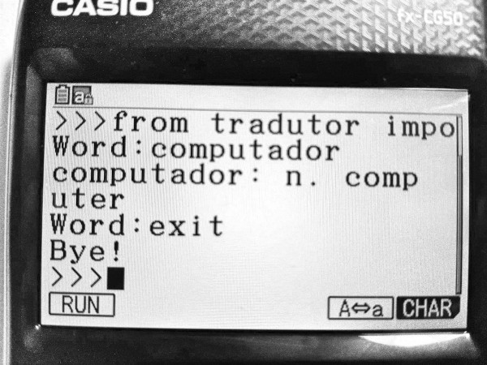

## What is it?
Extremely small and simple PT > EN transaltor for science Casio FX-CG50 calculator

## Installation:
Put `tradutor.py` file to CASIO internal directory. Interface too slow, it takes ~10 seconds.

## Usage:
Run application from Python Casio runtime (latest firmware is needed). It takes time.

## Thanks:
I used kindle dictionary from https://github.com/amferraz/kindle-dict-en-pt, thanks Cacovsky!
